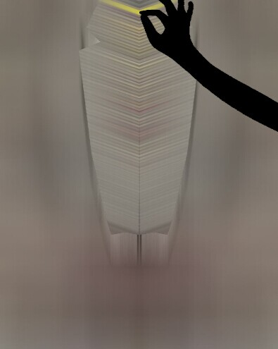

# OPEN-ZIPPER

使用canvas实现的拉链拉开的效果

### [查看效果](http://ajccom.github.io/open-zipper/)

## 实现原理

### 选取曲线函数

由下面的效果图可以大致知道拉链拉开的曲线和二次曲线很相像。

所以我选用了`1 / 2000 * y^2`这个函数获取指定行（Y）的图像的像素个数。

### 压缩图像

***由于图像是左右对称的，所以参与计算的图像只有半边大小。***

在遍历图片像素的过程中，获取相应的Y值，通过上一步的函数获得该行的图像宽度，然后计算出新图像在该行中每一个像素点所显示的相对于原图像的像素。

直白点就是把该行的像素做了等比压缩，比如原本240像素宽，压缩到100像素宽，由于一行的高度只有1像素，所以高度不需要参与计算了。

### 显示新图像

将新图像画在一个隐藏的canvas容器后，将这个canvas在主canvas上画两遍。（有一次需要反转图像）

### 效果图

-----------------------------

-----------------------------

-----------------------------

# 
# 
